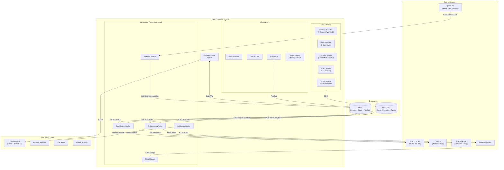
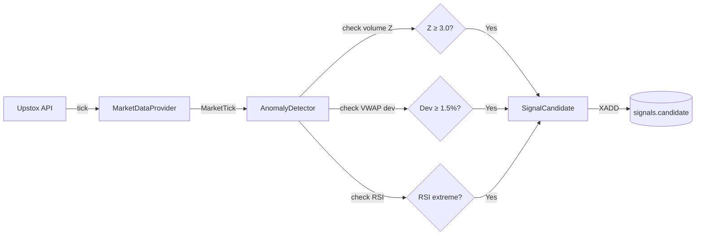
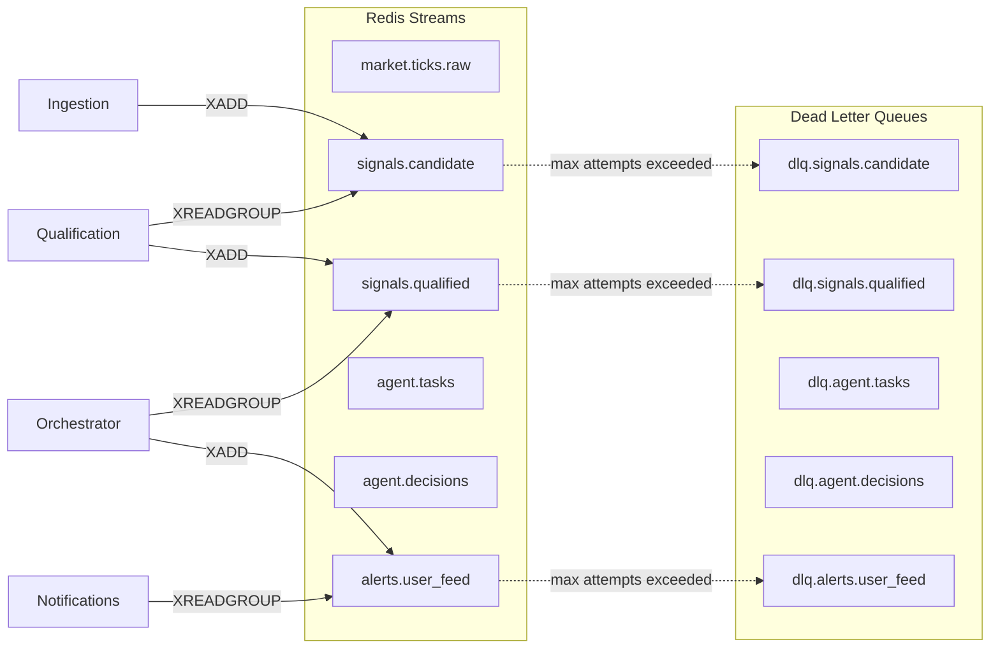
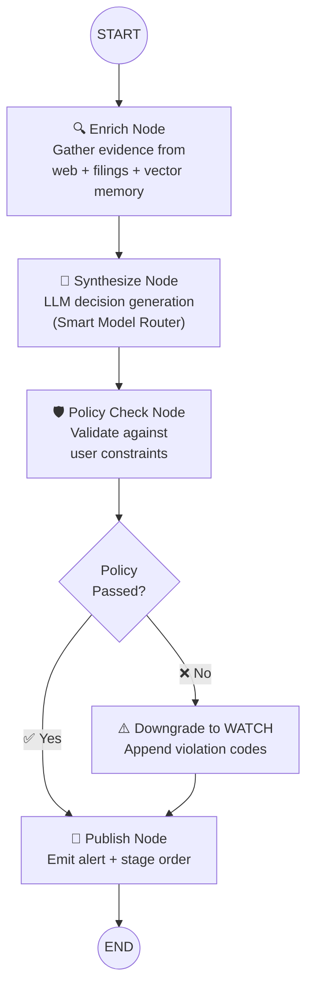
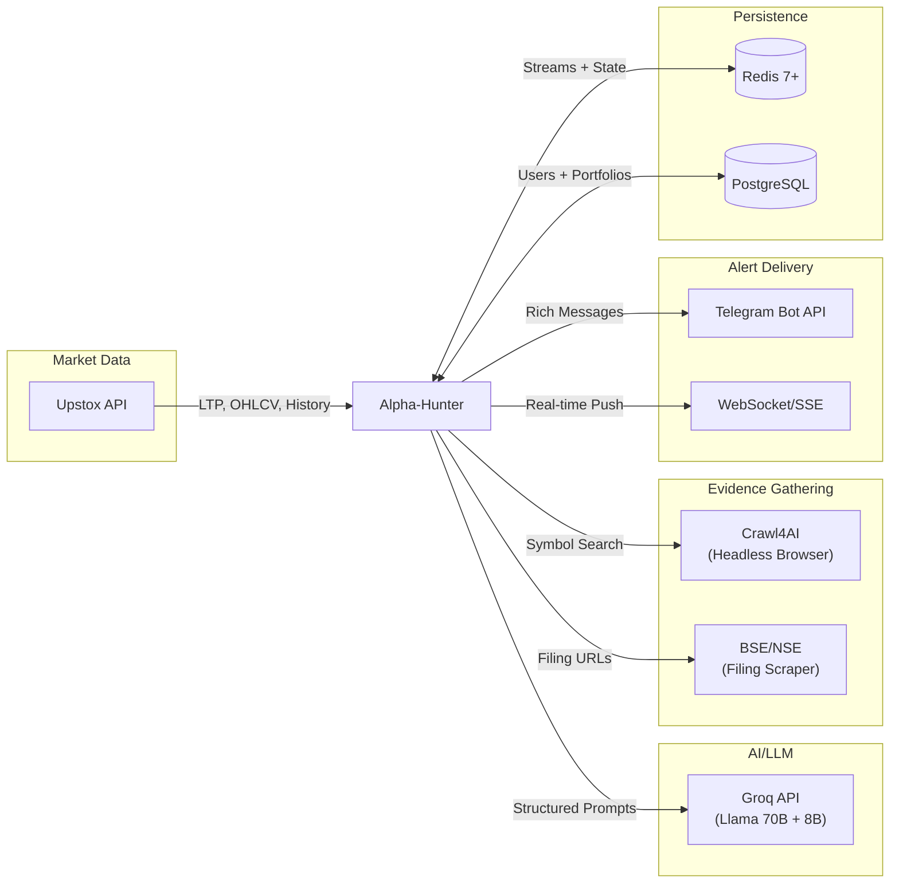
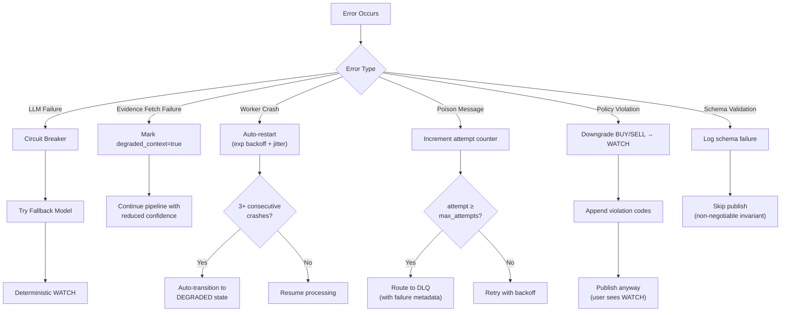
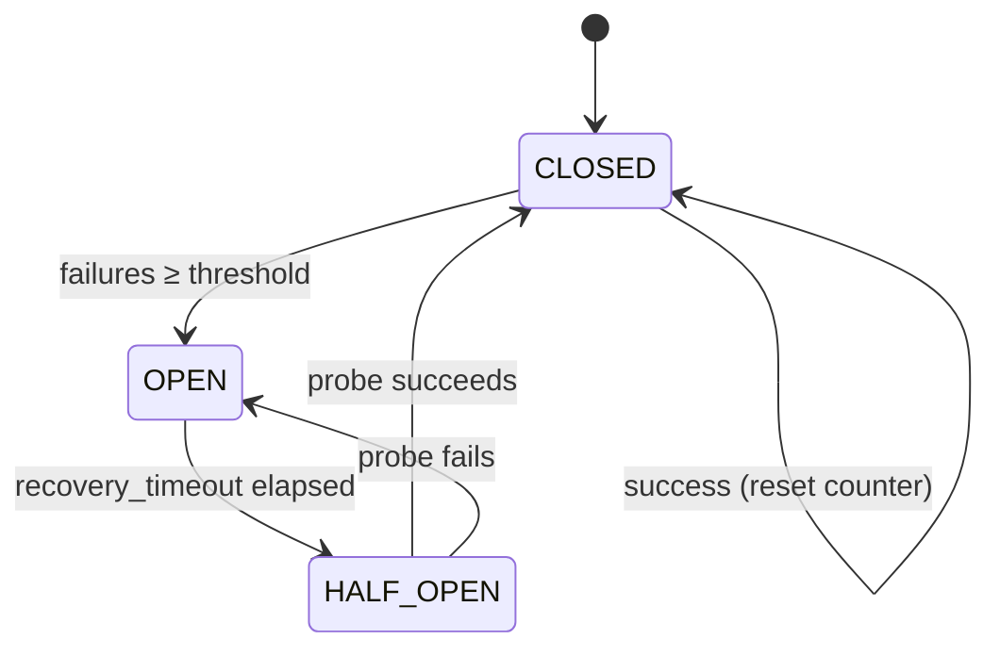
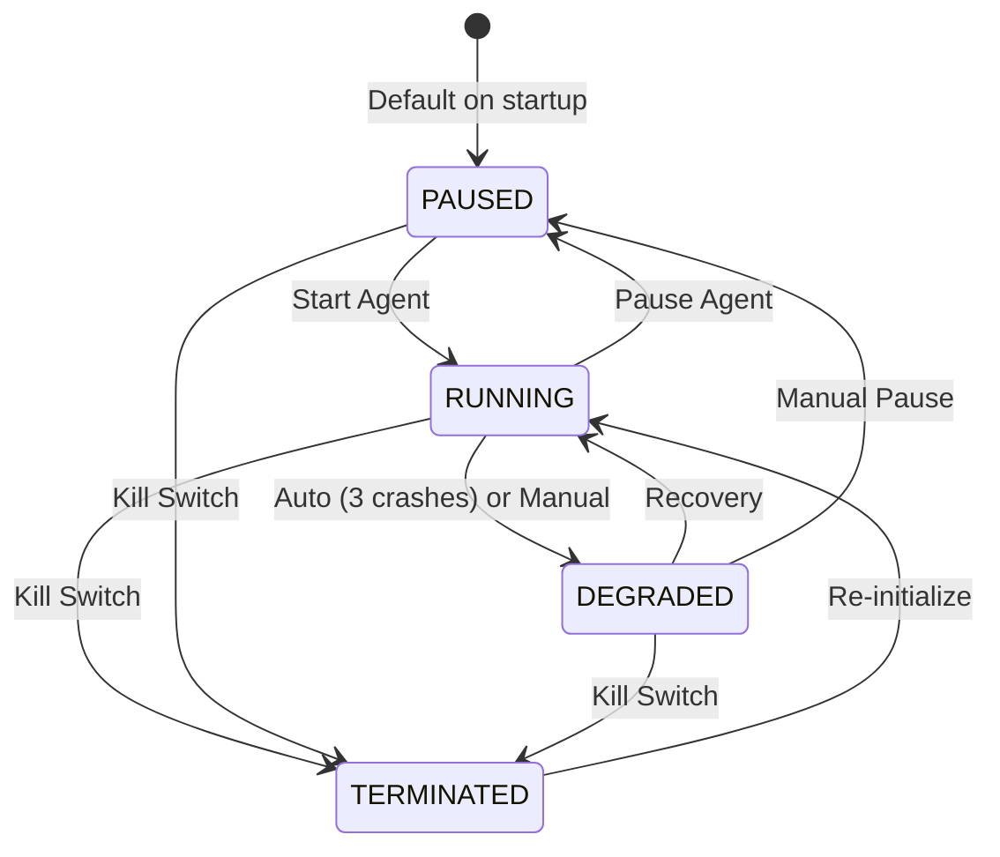

# Alpha-Hunter — System Architecture

> **Autonomous Financial Agent Platform for the Indian Stock Market**
>
> Version 2.0 · March 2026

---

## Table of Contents

1. [System Overview](#1-system-overview)
2. [High-Level Architecture](#2-high-level-architecture)
3. [Agent Roles & Responsibilities](#3-agent-roles--responsibilities)
4. [Communication & Data Flow](#4-communication--data-flow)
5. [LangGraph Decision Pipeline](#5-langgraph-decision-pipeline)
6. [Tool Integrations](#6-tool-integrations)
7. [Error Handling & Fault Tolerance](#7-error-handling--fault-tolerance)
8. [Agent Lifecycle & State Machine](#8-agent-lifecycle--state-machine)
9. [Observability & Monitoring](#9-observability--monitoring)
10. [Security & Isolation](#10-security--isolation)
11. [Frontend Architecture](#11-frontend-architecture)
12. [Directory Structure](#12-directory-structure)

---

## 1. System Overview

Alpha-Hunter is an **event-driven, always-on autonomous agent** that monitors the Indian equity market (NSE) in real time, detects statistical anomalies, synthesizes AI-powered investment recommendations, enforces per-user risk policy guardrails, and delivers alerts via dashboard and Telegram. The system is designed for **continuous autonomous operation** with self-healing capabilities.

### Core Pipeline (One Sentence)

```
Market Tick → Anomaly Detection → Signal Qualification → Evidence Enrichment → LLM Synthesis → Policy Guardrails → Alert Delivery
```

### Key Design Principles

| Principle | Implementation |
|---|---|
| **Never Crash** | 3-tier LLM fallback chain; circuit breakers; DLQ for poison messages |
| **Never Duplicate** | SHA-256 idempotency keys at every boundary |
| **Never Skip Policy** | Post-LLM guardrails with mandatory downgrade to WATCH on violation |
| **Always Observable** | Structured logging + OpenTelemetry traces on every event |
| **State-Gated** | All workers check `agent:state` before processing; kill-switch propagates in <500ms |

---

## 2. High-Level Architecture



---

## 3. Agent Roles & Responsibilities

### 3.1 Ingestion Worker

| Property | Detail |
|---|---|
| **File** | `app/ingestion/worker.py` |
| **Stream** | Produces → `signals.candidate` |
| **Responsibility** | Continuously ingest market ticks, run anomaly detection, emit signal candidates |
| **Provider** | Upstox REST API (live) or MockProvider (demo) |
| **Self-Healing** | Auto-restart with exponential backoff + jitter; auto-DEGRADED after 3 crashes |
| **Heartbeat** | Every 5 seconds to `worker:ingestion:heartbeat` |

**Internal Components:**

- **MarketDataProvider** (`providers/upstox.py`) — Connects to Upstox API, streams LTP/OHLCV data
- **AnomalyDetector** (`anomaly.py`) — Statistical detection engine:
  - **Volume Spike**: Z-score ≥ 3.0 on sliding window volume
  - **Price Deviation**: VWAP deviation ≥ 1.5%
  - **Momentum Break**: RSI ≤ 30 (oversold) or RSI ≥ 70 (overbought)
- **SlidingWindowIndicator** (`indicators.py`) — Per-symbol rolling statistics (mean, std, VWAP, RSI)



### 3.2 Qualification Worker

| Property | Detail |
|---|---|
| **File** | `app/qualification/worker.py` + `service.py` |
| **Stream** | Consumes `signals.candidate` → Produces `signals.qualified` |
| **Responsibility** | Apply 5 mandatory qualification rules; reject non-qualifying signals |

**5 Qualification Rules (ALL must pass):**

| # | Rule | Threshold |
|---|---|---|
| 1 | Agent state must be `RUNNING` | Exact match |
| 2 | Data freshness within `max_data_age_seconds` | ≤ 30s |
| 3 | Liquidity above minimum volume | ≥ 1,000 |
| 4 | Statistical significance (Z-score) | ≥ 2.0 |
| 5 | Confidence above floor | ≥ 30% |

**On rejection:** Emits `RejectedSignal` with `reason_code` (e.g., `DATA_TOO_STALE`, `LIQUIDITY_INSUFFICIENT`).

### 3.3 Orchestrator Worker (LangGraph)

| Property | Detail |
|---|---|
| **File** | `app/orchestrator/worker.py` + `graph.py` |
| **Stream** | Consumes `signals.qualified` → Produces `alerts.user_feed` |
| **Responsibility** | Fan-out to impacted users; execute LangGraph decision pipeline per (user, signal) |
| **Concurrency** | `asyncio.Semaphore` capping concurrent graph executions |
| **Idempotency** | `hash(user_id + signal_id + workflow_version)` checked before execution |

**Fan-out logic:**
1. Find all users holding the signaled symbol (via `PositionRepository`)
2. If no positions exist, fallback to all active users (capped at 5 in Phase 1)
3. Execute the LangGraph DAG independently for each user
4. Mark each (user, signal) pair as processed for exactly-once semantics

### 3.4 Notification Worker

| Property | Detail |
|---|---|
| **File** | `app/notifications/service.py` + `telegram.py` |
| **Stream** | Consumes `alerts.user_feed` |
| **Responsibility** | Fan-out alerts to connected clients (WebSocket/SSE) and Telegram |

**Delivery channels:**
- **WebSocket** — Direct push to connected dashboard sessions
- **SSE** — Server-Sent Events for clients that don't support WebSocket
- **Telegram** — Rich MarkdownV2 messages with decision badges, confidence bars, citations, risk flags

**Telegram is fire-and-forget** — never blocks the main pipeline.

### 3.5 Filing Monitor

| Property | Detail |
|---|---|
| **File** | `app/ingestion/filing_monitor.py` |
| **Responsibility** | Periodically scrape BSE/NSE/RBI for corporate filings; emit CORPORATE_FILING signals |
| **Sources** | BSE announcements, NSE corporate actions, RBI circulars |

---

## 4. Communication & Data Flow

### 4.1 Redis Streams Architecture

All inter-worker communication uses **Redis Streams** with consumer groups for exactly-once delivery:



### 4.2 Stream Configuration

| Stream | Retention (MAXLEN) | Trimming | Purpose |
|---|---|---|---|
| `market.ticks.raw` | Configurable (high) | Approximate (~) | Raw tick storage |
| `signals.candidate` | Configurable | Approximate (~) | Pre-qualification signals |
| `signals.qualified` | Configurable | Approximate (~) | Post-qualification signals |
| `agent.decisions` | Configurable | Exact | Audit trail |
| `alerts.user_feed` | Configurable | Exact | User delivery |

### 4.3 Event Envelope

Every message across all streams uses a universal `Event` envelope:

```python
class Event(BaseModel):
    event_id: str           # "{topic}:{ticker}:{timestamp_ms}"
    idempotency_key: str    # SHA-256 hash for deduplication
    topic: str              # Target stream
    event_type: str         # e.g., "signal.candidate"
    payload: dict           # Domain-specific data
    timestamp: float        # Unix epoch
    trace_id: str           # OpenTelemetry correlation
    workflow_id: str        # Graph execution ID
    signal_id: str          # Signal correlation
    user_id: str            # Tenant context
    tenant_id: str          # Isolation boundary
    ticker: str             # Stock symbol
    attempt: int            # Retry count
    max_attempts: int       # DLQ threshold (default: 5)
```

### 4.4 Redis State Keys

| Key | Type | Purpose |
|---|---|---|
| `agent:state` | String | Current runtime state (RUNNING/PAUSED/TERMINATED/DEGRADED) |
| `agent:state:updated_at` | String | Last transition timestamp |
| `agent:state:reason` | String | Reason for last transition |
| `agent:state:history` | List | Last 100 state transitions (audit) |
| `worker:ingestion:heartbeat` | String (TTL: 30s) | Worker liveness |
| `worker:ingestion:tick_count` | String | Total ticks processed |
| `portfolio:watch_symbols` | JSON String | Symbols the ingestion worker should track |

---

## 5. LangGraph Decision Pipeline

The orchestrator executes a **stateful LangGraph DAG** for each (user, qualified_signal) pair:



### 5.1 Graph State Schema

```python
class AgentGraphState(TypedDict, total=False):
    # Input (set at graph entry)
    signal: QualifiedSignal
    user_id: str
    tenant_id: str
    portfolio: PortfolioCanonical
    risk_profile: RiskProfile
    policy_constraints: PolicyConstraints
    daily_action_count: int

    # Computed by nodes
    evidence_pack: Optional[EvidencePack]
    decision: Optional[DecisionOutput]
    guarded_decision: Optional[GuardedDecision]

    # Control / Metadata
    error: Optional[str]
    retry_count: int
    workflow_id: str
    trace_id: str
    signal_id: str
```

### 5.2 Node Details

#### Enrich Node (`nodes/enrich.py`)
- Scrapes news from allowlisted domains via **Crawl4AI**
- Fetches corporate filings from BSE/NSE feeds
- Retrieves vector memory context (if available)
- Attaches provenance metadata: `source_url`, `published_at`, `fetched_at`, `reliability_score`
- On failure: marks `degraded_context=true` (pipeline continues with reduced confidence)

#### Synthesize Node (`nodes/synthesize.py`)
- Uses the **Smart Model Router** to select optimal LLM:

| Condition | Model | Reason |
|---|---|---|
| Z-score > 4.0 or confidence > 70% | `llama-3.3-70b-versatile` | High-complexity signal |
| ≥3 evidence items with good freshness | `llama-3.3-70b-versatile` | Rich evidence needs deeper reasoning |
| Degraded context | `llama-3.1-8b-instant` | Less data → smaller model sufficient |
| Default | `llama-3.1-8b-instant` | Cost-optimized standard path |

- **3-tier fallback chain:**
  1. Primary model (based on routing) → on failure:
  2. Alternate model → on failure:
  3. Deterministic WATCH advisory (never crashes)

- Output schema is **strictly validated** via `instructor` (Pydantic model binding)

#### Policy Check Node (`nodes/policy.py`)
- **5 Guardrail Rules** (post-LLM, pre-publish):

| # | Rule | Action on Violation |
|---|---|---|
| 1 | Max position concentration exceeded | Downgrade BUY → WATCH |
| 2 | Daily actionable recommendation limit reached | Downgrade → WATCH |
| 3 | Confidence below `min_confidence_buy_sell` | Downgrade → WATCH |
| 4 | Evidence age exceeds `max_evidence_age_hours` | Downgrade → WATCH |
| 5 | Portfolio data is stale | Downgrade → WATCH |

- Violations append `policy_reason_codes` to the decision

#### Publish Node (`nodes/publish.py`)
- Stages 1-click order tickets for BUY/SELL decisions (advisory mode)
- Emits `GuardedDecision` to `alerts.user_feed` stream
- Sends Telegram alert (fire-and-forget)
- Persists decision for idempotency

### 5.3 Decision Output Schema

```json
{
  "decision": "BUY | SELL | HOLD | WATCH",
  "confidence": 0-100,
  "rationale": "Personalized explanation with ₹ amounts",
  "citations": [
    {
      "url": "string",
      "title": "string",
      "source_type": "corporate_filing | news | analysis",
      "plain_summary": "One sentence a retail investor can understand",
      "published_at": "ISO-8601"
    }
  ],
  "portfolio_impact": {
    "position_delta_pct": 0.0,
    "sector_exposure_delta_pct": 0.0,
    "cash_impact": 0.0
  },
  "risk_flags": ["string"],
  "ttl_seconds": 300
}
```

---

## 6. Tool Integrations

### 6.1 External APIs



### 6.2 Integration Details

| Integration | Library | Purpose | Error Handling |
|---|---|---|---|
| **Upstox API** | `httpx` | Live market data, OHLCV history, instrument search | Retry with backoff; fallback to MockProvider |
| **Groq LLM** | `groq` + `instructor` | Decision synthesis with schema validation | Circuit breaker → fallback model → deterministic WATCH |
| **Crawl4AI** | `crawl4ai` | Web scraping for market evidence | Empty evidence + `degraded_context=true` |
| **BSE/NSE** | `httpx` + `BeautifulSoup` | Corporate filing scraper | Log warning; continue with available filings |
| **Telegram** | `httpx` | Alert delivery (MarkdownV2) | Fire-and-forget; never blocks pipeline |
| **Redis** | `redis.asyncio` | Streams, state, pub/sub, caching | Reconnect with exponential backoff + jitter |
| **PostgreSQL** | `SQLAlchemy` (async) | User, portfolio, position, event persistence | Connection pool with retries |

---

## 7. Error Handling & Fault Tolerance

### 7.1 Error Recovery Hierarchy



### 7.2 Circuit Breaker (3-State)



| Parameter | Default | Description |
|---|---|---|
| `failure_threshold` | 5 | Failures before tripping |
| `recovery_timeout_seconds` | 60 | Time before probe |
| `half_open_max_calls` | 3 | Recovery probe limit |

### 7.3 Dead Letter Queue (DLQ)

Failed events are routed to `dlq.{source_topic}` after exceeding `max_attempts` (default: 5).

**DLQ entry includes:**
- Original event payload
- `error_type` + `error_message`
- Source topic
- Attempt count
- Timestamp when routed

**DLQ streams have NO trimming** — preserved for audit and replay.

### 7.4 Worker Self-Healing

```python
# Pseudocode from ingestion worker
restart_count = 0
while restart_count < max_restarts:
    try:
        await _run_ingestion_loop()
        restart_count = 0  # Clean exit → reset
    except CancelledError:
        return  # Graceful shutdown
    except Exception:
        restart_count += 1
        wait = min(base * 2^restart_count, max_backoff) + random_jitter
        
        if restart_count >= 3:
            transition_to(DEGRADED)  # Auto-degrade
        
        await sleep(wait)
```

### 7.5 Non-Negotiable Invariants

| # | Invariant | Enforcement |
|---|---|---|
| 1 | No RUNNING state → No pipeline execution | Agent state gate in every worker |
| 2 | No valid schema → No publish | `instructor` Pydantic validation |
| 3 | No policy pass → No actionable recommendation | Policy engine downgrades to WATCH |
| 4 | No checkpoint write → No completion ack | Idempotent write before XACK |
| 5 | No tenant isolation → Fail closed | `tenant_id` on every query |

---

## 8. Agent Lifecycle & State Machine

### 8.1 State Transitions



### 8.2 Kill Switch Mechanism

The `KillSwitch` provides **sub-500ms state propagation**:

1. **Atomic Redis SET** — `agent:state` key updated
2. **Pub/Sub Broadcast** — `agent.control` channel notifies all workers instantly
3. **Worker Polling** (fallback) — Workers check state every heartbeat interval

```
API Request → KillSwitch.transition() → Redis SET + PUBLISH → Workers update local state
                                                                    ↑
                                                            ≤ 500ms propagation
```

### 8.3 State Behavior

| State | New Tasks | In-Flight Tasks | LLM Calls | Order Staging |
|---|---|---|---|---|
| **RUNNING** | ✅ Accept | ✅ Continue | ✅ Allowed | ✅ Allowed |
| **PAUSED** | ❌ Reject | ⏸️ Per pause policy | ❌ Blocked | ❌ Blocked |
| **TERMINATED** | ❌ Reject | ❌ Hard stop | ❌ Blocked | ❌ Blocked |
| **DEGRADED** | ⚠️ Limited | ✅ Continue | ⚠️ Constrained | ❌ Advisory only |

---

## 9. Observability & Monitoring

### 9.1 Structured Logging

Every log entry is **JSON-structured** via `structlog` with PRD-mandated context keys:

```json
{
  "event": "anomalies_detected",
  "level": "info",
  "timestamp": "2026-03-29T14:00:00.000Z",
  "trace_id": "trace-abc123",
  "workflow_id": "wf-def456",
  "signal_id": "sig-789ghi",
  "user_id": "user-001",
  "ticker": "RELIANCE",
  "agent_state": "RUNNING",
  "symbol": "RELIANCE",
  "count": 2,
  "types": ["VOLUME_SPIKE", "MOMENTUM_BREAK"]
}
```

### 9.2 OpenTelemetry Metrics

| Metric | Type | Description |
|---|---|---|
| `agent.signal.throughput` | Counter | Total signals processed |
| `agent.signal.qualified` | Counter | Signals that passed qualification |
| `agent.signal.rejected` | Counter | Signals that failed qualification |
| `agent.llm.latency` | Histogram | LLM call latency (ms) |
| `agent.llm.schema_failures` | Counter | LLM responses failing schema |
| `agent.enrichment.success` | Counter | Successful enrichment ops |
| `agent.enrichment.failure` | Counter | Failed enrichment ops |
| `agent.alert.latency` | Histogram | Signal-to-alert e2e latency |
| `agent.dlq.depth` | UpDownCounter | Dead letter queue depth |
| `agent.tasks.active` | UpDownCounter | Active orchestration tasks |

### 9.3 Latency SLOs

| Percentile | Target | Action on Breach |
|---|---|---|
| p50 | < 1.2s | — |
| p95 | < 3.0s | Alert ops |
| p99 | < 5.0s | Auto-DEGRADED if persistent |

### 9.4 Cost Tracking

The `CostTracker` proves smart model routing efficiency:

```
Total Calls by Model:
  llama-3.3-70b-versatile: 12 calls (high-complexity)
  llama-3.1-8b-instant:    38 calls (standard)
  fallback:                 2 calls (when LLM unavailable)

Cost Savings: 78.3% vs. always using 70B
Routing Strategy: complexity-based (z-score → 70B, standard → 8B, degraded → 8B)
```

---

## 10. Security & Isolation

### 10.1 Secrets Management

| Secret | Storage | Access |
|---|---|---|
| Upstox API keys | `.env` file | `get_settings()` only |
| Groq API key | `.env` file | DecisionEngine only |
| Telegram bot token | `.env` file | TelegramBot only |
| DB connection string | `.env` file | SQLAlchemy engine |

- All secrets encrypted at rest (AES-256 recommended for production)
- Never exposed to frontend or logs (redacted in structured logging)

### 10.2 Tenant Isolation

- Every event carries `tenant_id` and `user_id`
- Database queries scoped by `user_id`
- Decision logs include `tenant_id` for audit
- Cache keys namespaced per tenant

### 10.3 API Security

- CORS configured (whitelist in production)
- Control-plane commands (lifecycle changes) require authorization
- Order confirmation requires explicit user confirmation (human-in-the-loop)

---

## 11. Frontend Architecture

### 11.1 Component Topology

```mermaid
flowchart TB
    subgraph Dashboard["Dashboard (page.tsx)"]
        HEADER["Header<br/>Agent State Control + KPI Strip"]
        KPI["Financial KPI Cards<br/>(Portfolio Score, P&L, Signal Accuracy, Alpha Edge)"]

        subgraph Grid["Main Grid"]
            LEFT["Left Column"]
            RIGHT["Right Column"]
        end

        LEFT --> PM2["PortfolioManager<br/>(Holdings + Valuation)"]
        LEFT --> PR["PortfolioNewsRadar"]
        LEFT --> PPA["PortfolioPatternAgent"]

        RIGHT --> MR["MarketRadar<br/>(Live Anomaly Feed)"]
        RIGHT --> AC["AlertCards<br/>(Decision Feed)"]
        RIGHT --> PS2["PatternScanCard"]
        RIGHT --> MV["MarketVideoCard"]

        SIDEBAR["Sidebar Panels"]
        SIDEBAR --> CA2["ChatAgent"]
        SIDEBAR --> TS["TelegramSetup"]
        SIDEBAR --> IP["ImpactPanel"]
    end

    subgraph State["State Management"]
        STORE["Zustand Store<br/>(store.ts)"]
        LS["localStorage<br/>(Portfolio Holdings)"]
    end

    subgraph API2["Backend Calls"]
        REST["REST API<br/>/api/v1/*"]
        WSS["WebSocket<br/>/api/v1/alerts/ws"]
        POLL["Polling<br/>(45s interval)"]
    end

    Dashboard --> STORE
    Dashboard --> LS
    Dashboard --> REST
    Dashboard --> WSS
    KPI --> POLL
```



### 11.2 Data Flow (Frontend → Backend)

| Action | Endpoint | Method | Purpose |
|---|---|---|---|
| Start/Pause/Kill Agent | `/agent/lifecycle` | POST | State transitions via KillSwitch |
| Fetch Agent Status | `/agent/status` | GET | Health, metrics, worker states |
| Portfolio Valuation | `/market/portfolio-value` | POST | Real-time CMP from Upstox |
| Live Alerts | `/alerts/ws` | WebSocket | Real-time decision feed |
| Add/Edit Holdings | localStorage + StorageEvent | — | Cross-component sync |
| Pattern Scan | `/patterns/scan/{symbol}` | GET | Chart pattern detection |
| Chat Query | `/chat/query` | POST | AI-powered portfolio assistant |

---

## 12. Directory Structure

```
ET/
├── ARCHITECTURE.md          ← You are here
├── backend/
│   └── app/
│       ├── main.py          # FastAPI factory + lifespan
│       ├── config.py        # Settings (env-driven)
│       ├── dependencies.py  # Redis + DB dependency injection
│       │
│       ├── api/             # REST API layer
│       │   ├── v1/          # Versioned routes (agent, portfolio, alerts, market, ...)
│       │   └── routers/     # Feature routers (patterns, video, chat, intelligence)
│       │
│       ├── core/            # Shared infrastructure
│       │   ├── enums.py           # AgentState, Decision, StreamTopic, ...
│       │   ├── schemas.py         # Pydantic models (domain types)
│       │   ├── events.py          # Event envelope + idempotency
│       │   ├── circuit_breaker.py # 3-state circuit breaker
│       │   ├── observability.py   # structlog + OpenTelemetry
│       │   ├── exceptions.py      # Domain exceptions
│       │   └── security.py        # Auth + encryption utilities
│       │
│       ├── ingestion/       # Market data intake
│       │   ├── worker.py          # Always-on ingestion loop
│       │   ├── anomaly.py         # Statistical anomaly detector
│       │   ├── indicators.py      # Sliding window (VWAP, RSI, Z-score)
│       │   ├── market_hours.py    # NSE market hours checker
│       │   ├── filing_monitor.py  # BSE/NSE filing scraper
│       │   └── providers/         # Market data providers (Upstox, Mock)
│       │
│       ├── qualification/   # Signal quality gate
│       │   ├── service.py         # 5-rule qualification chain
│       │   └── worker.py          # Stream consumer worker
│       │
│       ├── enrichment/      # Evidence gathering
│       │   ├── scraper.py         # Crawl4AI web scraper
│       │   ├── filing_scraper.py  # BSE/NSE filing parser
│       │   └── retriever.py       # Vector memory retrieval
│       │
│       ├── decision/        # LLM synthesis
│       │   ├── engine.py          # Smart Model Router + fallback chain
│       │   └── cost_tracker.py    # Per-model cost tracking
│       │
│       ├── orchestrator/    # LangGraph pipeline
│       │   ├── graph.py           # DAG definition (enrich→synthesize→policy→publish)
│       │   ├── state.py           # TypedDict graph state schema
│       │   ├── worker.py          # Stream consumer + user fan-out
│       │   └── nodes/             # Graph node implementations
│       │       ├── enrich.py
│       │       ├── synthesize.py
│       │       ├── policy.py
│       │       └── publish.py
│       │
│       ├── policy/          # Post-LLM guardrails
│       │   └── engine.py          # 5 policy rules + downgrade logic
│       │
│       ├── execution/       # Order management
│       │   └── service.py         # Order staging (advisory mode)
│       │
│       ├── notifications/   # Alert delivery
│       │   ├── service.py         # WebSocket/SSE fan-out
│       │   └── telegram.py        # Telegram Bot rich messages
│       │
│       ├── control/         # Agent lifecycle
│       │   └── kill_switch.py     # Sub-500ms state propagation
│       │
│       ├── streams/         # Redis Streams infrastructure
│       │   ├── producer.py        # XADD + retention policies
│       │   ├── consumer.py        # XREADGROUP + XACK + XAUTOCLAIM
│       │   └── dlq.py             # Dead Letter Queue routing
│       │
│       ├── portfolio/       # Portfolio CRUD
│       │   └── service.py
│       │
│       ├── db/              # Database layer
│       │   ├── engine.py          # Async SQLAlchemy engine
│       │   ├── models.py          # ORM models
│       │   └── repositories.py    # Repository pattern
│       │
│       └── services/        # Advanced services
│           ├── chat_service.py         # AI chat agent
│           ├── candlestick_agent.py    # Pattern recognition
│           ├── pattern_scan_service.py # Chart pattern scanner
│           ├── intelligence_service.py # Market intelligence
│           └── video_engine_service.py # Market video generation
│
└── frontend/
    └── src/app/
        ├── page.tsx           # Main dashboard + KPI strip
        ├── store.ts           # Zustand state management
        ├── globals.css        # Design system
        └── components/
            ├── PortfolioManager.tsx      # Holdings CRUD + valuation
            ├── AlertCards.tsx            # Decision feed
            ├── MarketRadar.tsx          # Live anomaly radar
            ├── ChatAgent.tsx            # AI chat sidebar
            ├── PatternScanCard.tsx      # Chart pattern UI
            ├── PortfolioPatternAgent.tsx # Autonomous scanner
            ├── AgentTopology.tsx         # Worker topology graph
            ├── ImpactPanel.tsx          # Business impact metrics
            ├── ActionCenter.tsx         # Staged orders UI
            ├── TelegramSetup.tsx        # Telegram configuration
            └── ...
```

---

## Summary

Alpha-Hunter is a **production-grade autonomous agent** built on an event-driven architecture with enterprise-level fault tolerance. The system processes market events through a rigorous pipeline — from statistical anomaly detection to LLM-powered synthesis — with multiple layers of protection ensuring that **no invalid, unverified, or policy-violating recommendation ever reaches a user.** Every component is designed for continuous operation with self-healing capabilities, making it suitable for always-on financial advisory workloads.
